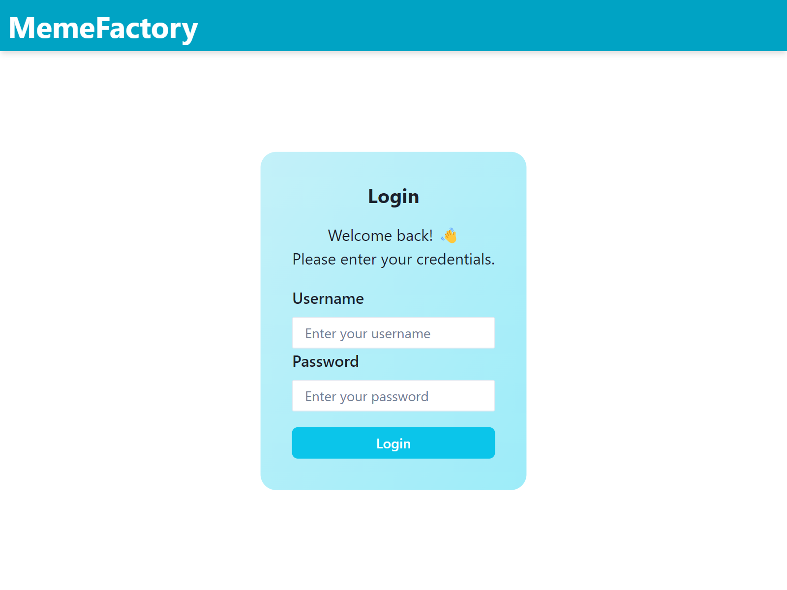
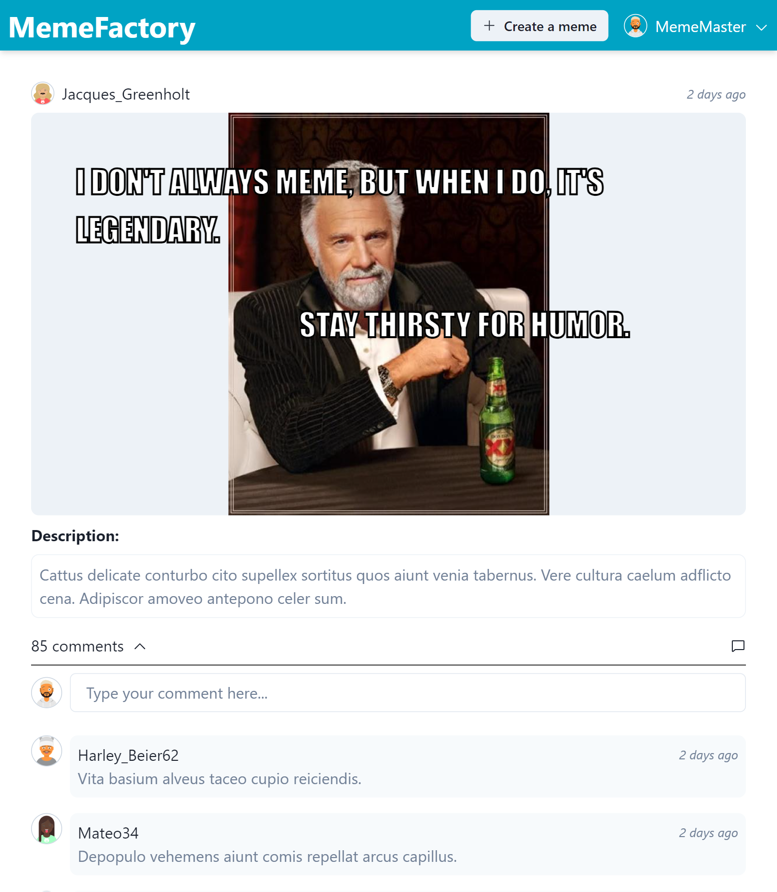
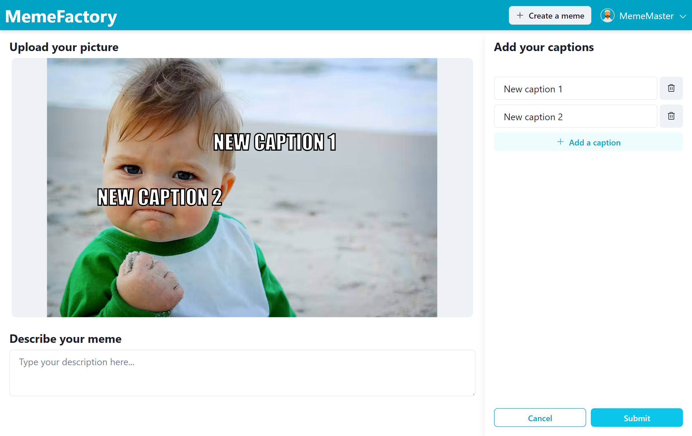

# Mozzaik365 : Frontend technical test

## Introduction 

Welcome to the repository of **Mozzaik365's Frontend Technical Test**.  
If you have landed here, it must mean that you have started a recruitment process with us and it is time to **show us your coding skills** 💪!

The goal of this test is to put you in a situation as close as what you would experience at **Mozzaik365**, which means:
- **A stress-free exercise** to do at home with nobody watching you and you can take the time you need
- **Nothing to setup from scratch**, we provide you a base project to work on and all you have to do is to code
- **You can use any tool** that you use on a daily basis such as Google, StackOverflow and even generative AI (ChatGPT, Github Copilot)

## The project

Let us introduce you to **MemeFactory**, an application that allows you to create **[memes](https://en.wikipedia.org/wiki/Internet_meme)** and share them with the rest of the community.  
The application consists of 3 screens:

1. **The login page**: Allows you to login with a username and a password
   
2. **The meme feed**: Displays the list of memes with their comments
   
3. **The meme creator**: Allows to create a meme by adding a picture and some captions on top of it
   

This project has been started by our team but is currently incomplete and suffer from some issues that need to be fixed. But we'll come to that later!

### Tech stack

The project is built the following stack:

- **[React](https://react.dev/)**: As a UI framework
- **[TypeScript](https://www.typescriptlang.org/)**: As a scripting language
- **[Vite](https://vitejs.dev/)**: For the bundling and the development server
- **[ChakraUI](https://v2.chakra-ui.com/)**: For the design system
- **[TanStack Router](https://tanstack.com/router/latest)**: For the routing
- **[TanStack Query](https://tanstack.com/query/latest)**: For asynchronous state management
- **[React Hook Form](https://react-hook-form.com/)**: For the forms management
- **[Vitest](https://vitest.dev/)**/**[Testing Library](https://testing-library.com/)**/**[MSW](https://mswjs.io/)**: For the unit tests

### Setup

Start by forking this repository and clone it locally.

Then, install the node modules:
```bash
npm install
```

Once the dependencies are installed, you can run the project by running the following command:
```bash
npm run dev
```

You'll be able to access the application from `http://localhost:5173/` and you can use the following credentials to login:
- Username: `MemeMaster`
- Password: `password`

The application comes with some unit tests that you can run by using the following command:

```bash
npm run test

## Or for the coverage
npm run coverage
```

### REST API

A fully functional REST API has been provided for this project.
You can access it from `https://fetestapi.int.mozzaik365.net`.  
An OpenAPI documentation is also available [here] (https://fetestapi.int.mozzaik365.net/swagger). Don't hesitate to have a look at it, you might find something useful to complete the following exercises.

## Instructions

Before you start the exercises, here are a few recommendations to make sure you meet all the expectations:
  - As we said, this exercise is meant to put you in a real-life situation. This means that the code and commits you produce should be of the quality you would expect from your colleagues. 
  - From the moment you start working on this project, it becomes your project. So you're free to change anything in it if you think it's necessary.
  - Don't hesitate to impress us by going beyond what is asked in the exercise.

Now that you know everything, we wish you a happy coding! 🎉

### Ex 1 - Review and optimize the meme feed code

The meme feed is supposed to work, but you'll quickly notice that it's extremely slow, making it almost unusable.
The reason for this is that it was built by **Jodric**, our intern.
He's really nice, but he still lacks some good reflexes when it comes to performance.

Your role here will be to:
- Identify the cause of the problem and write a report in `doc/review/meme-feed-code-review.md`.
- Refactor the code to make it as clean and performant as possible. The UI must remain the same, but you can adjust the UX if you feel it's necessary, as long as you don't degrade it.

### Ex 2 - Fix the comment form

Below each meme, you'll find a comment form that allows you to add a comment to a particular meme.  
At the moment, it doesn't seem to work, although some people have said that they can see their comment after refreshing the page.

Your job here will be to:
- Identify and fix the problem
- Write a unit test to make sure the feature works correctly. 

### Ex 3 - Finish the meme creator

The meme creator allows you to upload an image, add a description and add captions over the image.  
The user can create as many captions as they like and position them anywhere on the image.
Once submitted, the user will be redirected to the homepage to view their newly created meme.

The feature has already been started but never finished, so your mission is to:
- Understand what's left to do
- Do the remaining development

⚠️ *For this exercise, the OpenAPI documentation is incorrect (it's a known Swagger UI bug that doesn't handle nested objects correctly). The `POST /api/memes` endpoint expects a `multipart/form-data` body of the form:*
```
Picture=<binary data>
Description=Your description
Texts[0][Content]=Caption 1
Texts[0][X]=100
Texts[0][Y]=50
Texts[1][Content]=Caption 2
Texts[1][X]=42
Texts[1][Y]=84
...
```

### Ex 4 (bonus) - Fix the authentication

As you have certainly noticed, the authentication kind of works.  
However, you'll see that, as soon as you refresh the page, you get disconnected. It seems the authentication is not persisted.  
Also, when the token expires, the application just stop working instead of asking the user to login again.

So we need you to:
- Make sure that the authentication persist through refreshes
- Redirect the user to the login page whenever the token expires

## Submission

Once you have finished this test, you can submit it through this [form](https://forms.microsoft.com/e/n8eGwmMLe1).

We'll try to review it in the next 48 hours and get back to you to talk about your code!

In the meantime, if you have any question, don't hesitate to contact your hiring manager.

